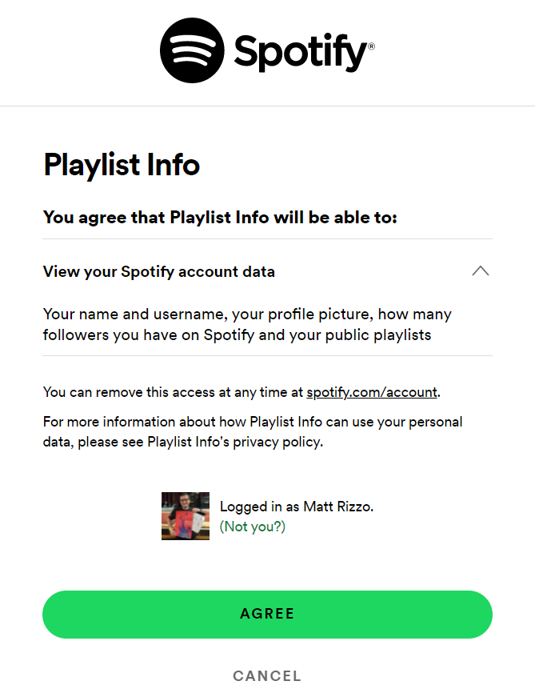
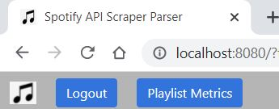
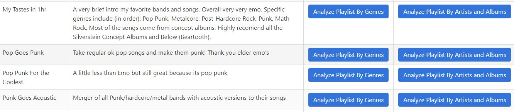
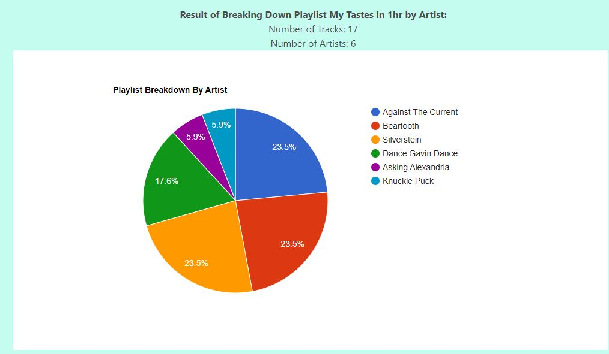
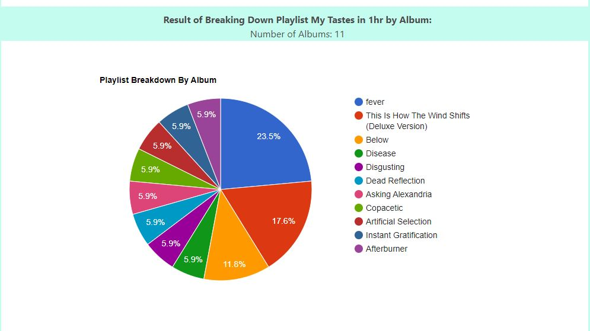

# spotify_api_scraper
Utilizes Spotify's API for devs to analyze playlists and viewing habits. Personal / for fun project because I use spotify so much

## Running the program
* Note: before running, please ensure the virtual environment is created as described in [Setup Guide](#setup-guide)
    * Whenever the program is run, it should be from the virtual environment python within [Spotify-api-scrapper-venv/bin/python](Spotify-api-scrapper-venv/bin/python)
  * This is automatically handled by the [start script](start.sh)

## Userflow & Example Running

1. Follow [Setup Guide](#setup-guide)
2. Run start script based on Operating System
   1. **Windows:** [start.bat](start.bat)
   2. **Ubuntu/Debian/Windows Git-Bash:** [start script](start.sh)
3. Go to [Homepage](<http://localhost:8080/>) - <http://localhost:8080/>
4. Follow authorization prompts - sign into spotify
  1. 
  2. Click Agree
5. Click **Playlist Metrics**
   1. 
6. See a list of all public Playlists
   1. 
   2. **Bonus:** You get to see my taste in Music *wink face*
7. Select **"Analyze Playlist By Artists and Albums"**
   1. 
   2. 
8. Select **"Analyze Playlist By Genre"**
   1. Currently not implemented / debating if possible
   2. Spotify lists multiple genres for each song, so analyzing genre's in a playlist requires judgment calls

## Setup Guide

1. (For Windows Only) Download [Python3.9](https://www.python.org/downloads/release/python-390/)
   1. **Note:** Using a different / earlier version of python will result in the code not working. Please be sure your version is python 3.9.
   2. Click your windows key and type `cmd` to open a command prompt
      1. Please run `py -0` to see a list of installed python versions.
      2. Please confirm that you see `"-3.9-64 *"` or `"-3.9-64 "`. If you do, installation was successful.
2. This scrapper requires your Spotify account to have access to the Developer API's
   1. To do this, sign up for an app as directed here: <https://developer.spotify.com/documentation/general/guides/authorization/app-settings/>
   2. **Create an application** - <https://developer.spotify.com/dashboard/applications>
   3. Add a user to your application - your spotify user
      1. click **Users and Access**
         1. [Users and Access](docs/images/setup/users_and_access_button.png)
      2. click **Add New User**
         1. [Add New User](docs/images/setup/add_user_button.jpg)
      3. Enter your Full Name and the email address associated with your spotify account
   4. Add Redirect URI's (steps follow)
      1. Click Edit Settings
         1. [Edit Settings](docs/images/setup/edit_settings_button.jpg)
      2. Go to **Redirect URI's field**
         1. Enter `http://localhost:8080/redirect_after_auth` (see below for example)
         2. [Redirect URI's field](docs/images/setup/add_uri_callback.jpg)
      3. Type in the url EXACTLY as shown in the image **(Step 1)**
      4. Click the add button whose position is marked in the image **(Step 2)**
      5. Feel free to add my GitHub link (but it's not necessary)
3. Copy the template provided by [data/default_app_auth.json](data/default_app_auth.json) into `data/app_auth.json`
   1. **THIS IS IMPORTANT**. The application will search for this file. If it does not exist, you will be prompted to create it.
   2. Replace the default values with those associated with your Application
      1. see: <https://developer.spotify.com/documentation/general/guides/authorization/code-flow/>
      2. client_id = client id of your new registered application
4. Run install scripts. Pick the correct one based on your operating system:
   1. **Windows:**  [install/setup.bat](install/setup.bat)
      1. Note: this can be done through command prompt OR just double clicking on the file in `File Explorer`
   2. **Ubuntu/Debian/Windows Git-Bash:** [install/install.sh](install/install.sh)

## TODO

* try merging last 2 routes into 1 render template for pie chart
* get % genre in playlist
* implement state check during auth
  * better secure against XSS
* BETTER way to timeout token for user
* Add the image of each playlist to the playlist table
* better handle when track has feat artists
* have clicking on pie chart link to the artist/album itself
* make end url's not show the long params
