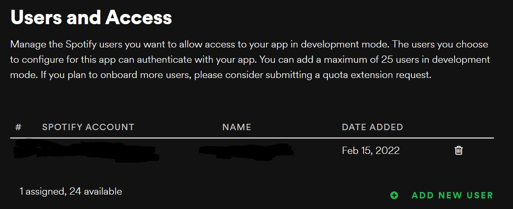
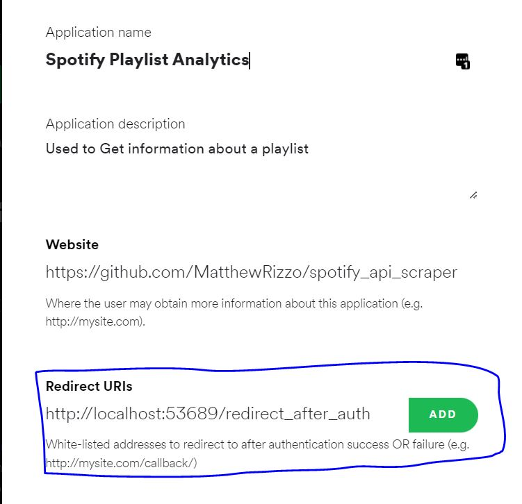

# spotify_api_scraper
Utilizes Spotify's API for devs to analyze playlists and viewing habits. Personal / for fun project because I use spotify so much

## Running the program
* Note: before running, please ensure the virtual environment is created as described in [Setup Guide](#setup-guide)
    * Whenever the program is run, it should be from the virtual environment python within [Spotify-api-scrapper-venv/bin/python](Spotify-api-scrapper-venv/bin/python)
  * This is automatically handled by the [start script](start.sh)

## Userflow & Example Running

1. Follow [Setup Guide](#setup-guide)
2. Run start script based on Operating System
   1. **Windows:** Open File Explorer and navigate to where you downloaded / extracted this code
      1. Dobule Click on the start batch file
         1. 
      3. The first time the program is run, Windows Firewall might block the application.
      4. Please click "Allow Access". This issue should not happen again.
      5. When ending the program please do `Ctrl+C` then respond to `Terminate batch job (Y/N)?` with `y` and click enter.
   2. **Ubuntu/Debian/Windows Git-Bash:** [start script](start.sh)
3. Go to [Homepage](<http://localhost:53689/>) - <http://localhost:53689/>
4. Follow authorization prompts - sign into spotify
  1. 
  2. Click Agree
5. Click **Playlist Metrics**
   1. 
6. See a list of all public Playlists
   1. 
   2. **Bonus:** You get to see my taste in Music *wink face*
7. Select **"Analyze Playlist"**
   1. 
   2. 
   3. 

## Setup Guide

### Step 1: Python Install

1. (For Windows Only) Download [Python3.9](https://www.python.org/downloads/release/python-390/)
   1. **Note:** Using a different / earlier version of python will result in the code not working. Please be sure your version is python 3.9.
   2. 
   3. When the download finishes, run the executable by double clicking on it
      1. Run through whatever instructions the installer gives you
   4. Click your windows key and type `cmd` to open a command prompt
      1. Please run `py -0` to see a list of installed python versions.
      2. Please confirm that you see `"-3.9-64 *"` or `"-3.9-64 "`. If you do, installation was successful.

### Step 2 Download Code For This Project

1. Donwload this code somewhere on your computer from GitHub
   1. Click the `Download ZIP` Button
      1. 
   2. Extract the Zip folder to any folder you want
      1. Go to your `Downloads` folder
      2. Right click on the zip file you just donwloaded
      3. Click `Extract All`
      4. Select which folder to extract it to by clicking `Browse`
      5. Click the `Extract` Button on the widnow that pop'd up
   3. Remember this folder!!

### Step 3: Setup Spotify API

1. This scrapper requires your Spotify account to have access to the Developer API's
   1. To do this, sign up for an app as directed here: <https://developer.spotify.com/documentation/general/guides/authorization/app-settings/>
   2. **Create an application** - <https://developer.spotify.com/dashboard/applications>
   3. Add a user to your application - your spotify user
      1. click **Users and Access**
         1. 
      2. click **Add New User**
         1. 
      3. Enter your Full Name and the email address associated with your spotify account
   4. Add Redirect URI's (steps follow)
      1. Click Edit Settings
         1. 
      2. Go to **Redirect URI's field**
         1. Enter `http://localhost:53689/redirect_after_auth` (see below for example)
         2. 
      3. Type in the url EXACTLY as shown in the image **(Step 1)**
      4. Click the add button whose position is marked in the image **(Step 2)**
      5. Feel free to add my GitHub link (but it's not necessary)

### Step 4: Setup Project Code

1. Go to the folder you extracted the zip file to [Download the Code for this Project](#step-2-download-code-for-this-project)
2. Copy the template provided by [data/default_app_auth.json](data/default_app_auth.json) into `data/app_auth.json`
   1. This can be done by:
      1. Right clicking [data/default_app_auth.json](data/default_app_auth.json)
      2. Selecting "copy"
      3. Right clicking in `File Explorer`
      4. Selecting Paste
      5. Right clicking the file called `default_app_auth - Copy`
      6. Selecting `Rename`
      7. Clicking delete / backspace
      8. Typing in `app_auth` and clicking the `Enter` key
   2. **THIS IS IMPORTANT**. The application will search for this file. If it does not exist, you will be prompted to create it.
   3. Replace the default values with those associated with your Application
      1. See: <https://developer.spotify.com/documentation/general/guides/authorization/code-flow/>
      2. client_id = client id of your new registered application
      3. Client Secret - also comes from your application.
         1. **DO NOT SHARE THIS WITH OTHERS**
      4. The values look like this in your app's webpage
         1. 
3. . Run install scripts. Pick the correct one based on your operating system:
   1. **Windows:**  [install/setup.bat](install/setup.bat)
      1. Note: this can be done through command prompt OR just double clicking on the file in `File Explorer`
         1. 
      2. If a warning from windows appears click "More Info" and then "Run Anyway"
         1. 
   2. **Ubuntu/Debian/Windows Git-Bash:** [install/install.sh](install/install.sh)
   3. Allow the install script to finish
